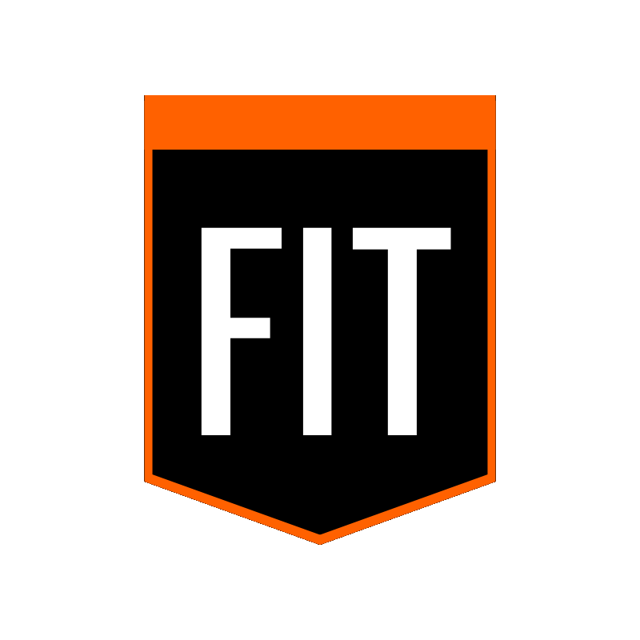

# Fitter 1.0

## Quick Start

Fitter is a game engine developed in C++. This engine focuses on being simple, basic, and efficient for game development for beginners. It is based on the object and component system. This game engine is all yours and is licensed under the MIT Copyright License.

## Availability

The game engine is compatible with the following operating systems:

|Operating system    |Available |
|--------------------|----------|
|Windows             | Valid    |
|Linux               | Valid    |
|iOS                 | Invalid  |
|Android             | Invalid  |

## Resources

Project resources you should check out to be more informed.

* [1. LICENSE](<LICENSE.md>)
* [2. CHANGELOG](<CHANGELOG.md>)
* [3. CONTRIBUTING](<CONTRIBUTING.md>)
* [4. THIRD PARTY NOTICE](<libs/THIRD_PARTY_NOTICES.md>)

## Requests and Contributing

You can find the contribution and request guide in the [CONTRIBUTING](<docs/CONTRIBUTING.md>) file. There you will find all the details for requesting and contributing to the project. If you are truly interested in supporting the project with your contribution, we would be grateful!

## Copyright and License

This project is licensed under the MIT license. By installing this engine, your copy of the engine belongs to you and cannot be taken away. You have the right to make any changes without restriction.